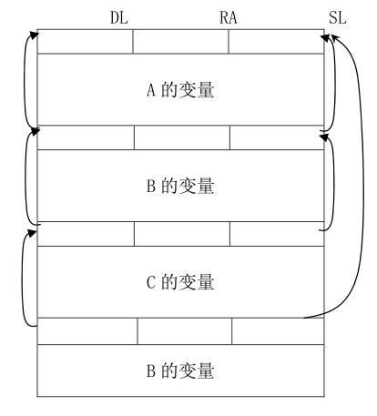
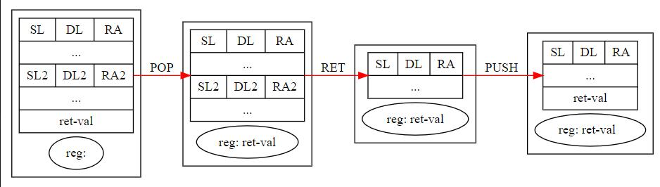

# PL0-compiler

[](https://github.com/mbinary/PL0-compiler/stargazers)
[](https://github.com/mbinary/PL0-compiler/network/members)
[](https://travis-ci.org/mbinary/PL0-compiler?branch=master)
[](.)
<!--  [](http://creativecommons.org/licenses/by-nc-sa/4.0/)  copy LICENCE -->
[](LICENSE)
[](.)
[](https://codecov.io/gh/mbinary/PL0-compiler)
[](https://codebeat.co/projects/github-com-mbinary-pl0-compiler-master)


> A compiler for c-like programming language **based on** PL0, which is a dynamic, strong typing language.

See grammar [here](#grammar), [wikipedia-PL0](https://en.wikipedia.org/wiki/PL/0), and download [this pdf(zh)](src/编译原理和技术实践2017.pdf) for more details.

# QuickStart
```shell
usage: parser.py [-h] [-i] [-s] [-t] [-v] [-f FILE]

optional arguments:
  -h, --help            show this help message and exit
  -i, --instruction     output instructions
  -s, --stack           output data stack when executing each instruction
  -t, --token           output tokens when parsing
  -v, --varible         output varibles for every static environment
  -f FILE, --file FILE  compile and run codes. Without this arg, enter
                        interactive REPL
```

Run `python parse.py` and enter a REPL state, you can type and run sentences and expressions interactively

# Examples
Note that when in REPL, every sentence or expresion or block ends with '.'. But in program codes, only the whole program ends with a dot.
##  interactive-expression
Therer are some expressions and sentence in file expr.txt, now test it.
`python parser.py -f test/expr.txt`

```c
>> codes:
1     // expression
2     var a=3,b=2,c;.

>>  c:=a+1.
>> begin c; c+1!=1 ; c+1=5 end.
result: 4.0; True; True;
>> for(;b>=0;b:=b-1) print('random(100): %d',random(100)) .
random(100): 14
random(100): 60
random(100): 58
>> begin ++1--1; 1<<2+3%2; 2&1 end.
result: 2.0; 8; 0;
>>   -1+2*3/%2.
result: 2.0;
>>    (1+2.
line 1: ( 1 + 2 .
                ^
[Error]: Expected ")", got "."
>> 4!!.
result: 620448401733239439360000;
>> codes:
1     if   0 then 1
2     elif 1>2 then 2
3     elif false then 3
4     else 4.

result: 4.0;
```
## fibonacci
Run `python parser.py  -f test/fibonacci.txt`

```c
>> codes:
1     func fib(n)
2     begin
3         if n=1 || n=2 then return 1;
4         return fib(n-1)+fib(n-2);
5     end ;
6     var n=1;
7     begin
8         while n<15 do
9         begin
10            print('fib[%d]=%d',n,fib(n));
11            n :=n+1;
12        end;
13    end
14    .

fib[1]=1
fib[2]=1
fib[3]=2
fib[4]=3
fib[5]=5
fib[6]=8
fib[7]=13
fib[8]=21
fib[9]=34
fib[10]=55
fib[11]=89
fib[12]=144
fib[13]=233
fib[14]=377
```

Try the following commands to explore more examples.
```shell
python parser.py -f test/factorial.txt
python parser.py -f test/closure.txt
python parser.py -f test/closure.txt -i
python parser.py -f test/closure.txt -t
python parser.py -f test/closure.txt -s
python parser.py -f test/closure.txt -istv
python parser.py  # enter interactive repl
```
# Description
## ident type
* constant
* varible
* function
## operator
### relation opr
* \<
* \>
* \<=
* \>=
* = equal 
* !=
* odd  
### bit opr
* \& bitand
* \| bitor
* \~ bitnot
* \<\< left shift
* \>\> right shift
### arithmetic opr
* \+  add/plus
* \-  sub/minus
* \*  multiply
* \/  divide
* \/\% integer div
* %  mod
* \^  power
* \!  factorial
### conditon opr
*  ?:  eg   a\>b ? c:d
## control structure
* if elif else
* for
* while
* break
* continue
* return

## builtin function
* print(formatStr,arg1,...)
* random(), random(n)

# Grammar
```scala
program =  body "."
body = {varDeclaration ";" |  constDeclaration ";" |  "func" ident "(" arg_list  ")" body ";"}  sentence

varDeclaration = "var"  varIdent { "," varIdent}
varIdent  = ident ["=" number] | ident  { "[" number "]" } 
constDeclaration = "const" ident "=" number {"," ident "=" number}

sentence = [ ident ":=" { ident ":=" } sentenceValue 
                |  "begin" sentence { ";" sentence}  "end"
                |  "if" sentenceValue "then" sentence {"elif" sentence} ["else" sentence]
                |  "while" sentenceValue "do" sentence
                |  "do" sentence "while" sentenceValue 
                |  "switch" sentenceValue {"case" sentenceValue {"," sentenceValue} ":" [setenceValue]}  (* ["default" ":" sentenceValue]   to do *)
                |  "break"
                |  "continue"
                |  ["return"] sentenceValue
                |  "print" "(" str,real_arg_list ")" ]

sentenceValue =   condition

arg_list =  ident { "," ident}

real_arg_list = sentenceValue {"," sentenceValue }


condition = condition_or [ "?" sentenceValue ":" sentenceValue ]
condition_or  = condition_and { "||" condition_or }
condition_and = condition_not { condition_not "&&" condition_and}
condition_not = {"!"} condition_unit
condiiton_unit = ["odd"] expression
                        | expression ("<" | ">" | "<=" | ">=" | "=" | "!=") expression

expression =  level1 { ("<<"| ">>" | "&" | "|") level1 }
level1  = level2 { ( "+" | "-" ) level2 }
level2 = level3 { "*" | "/" | "/%" | "%" ) level3 }
level3 = level4 {"^" level4}
level4 = item {"!"}          (*  factorial *)
item =  number|"true"|"false" | ident { "(" real_arg_list ")" }| "(" sentenceValue" )" | ("+" | "-" | "~" ) item
```
## syntax 
Writet down syntax, then convert left recursion to right recursion.
Namely we should change the following productions:
expr, level0, level, level3

We notice that
```scala
A -> Aa|b
```
equls to 
```scala
A -> bR
R -> nil | aR
```
so here are the  right-recursion productions 
```scala
expr   -> level1 interval1
interval1 -> nil | {&|'|'|>>|<<|} interval1

level1 -> level2 interval2
interval2 -> nli | {+|-} interval2

level2 -> level3 interval3
interval3 -> nil | {*|/|//|%} interval3

level3 -> level4 | level4 ^ level3

level4 -> item interval4 
interval4 -> nil |! interval4

item   -> NUM|E|PI|ln(expr)|(expr)| + item| - item| ~ item
```

When implementing the parser, we can use a loop structure to implement the right recursion because it's tail-recursive.

For instance, we can simply find that the production for `level4` is 
```scala
level4 -> item | item ! | item!! |item !!! | ...
```
Though we can't write a production with infinite loops, we can write it in code like this: 
```python
match_level4():
    result = match(item)
    while lookAhead  matches item:
        match("!")
        result = factorial(item)
    return result
```

# Instruction generation
We designed several instructions that can be generated for the target machine. 
To simplify this problem, we will emulate this virtual machine and execute instructions in python.
## register
This machine has three registers:
* `b` is the base register that contains the base pointer to locate a varible in the data stack
* `regs` are a series of registers. Currently the first one is used for returning value of latest function call, and the second one is used to store the `switch` value
* `pc` is the pc register that points to the instruction 
## stack
There are two stack in this virtual machine. 
One contains the instructions, visited by register `pc`. It won't change when executing instructions, so we can assume it's readonly
The other is data stack. It dynamiclly changes when running the program.

For each level, the first is the base address of this level. The second place is the static chain to visit the upper level's varibles. The third place contains the return address of the upper level.
And the other places in one level contains local varibles and real time data for calculation.


Each time we call a function, the level increases 1. Also, the level decreases 1 when we return from a function.
## instruction
Every instruction consists of three parts. The first is the name of the instruction. Generally, the second is the level diifference of a identifier(if it has). And the third part is the address.

name | levelDiff | address | explanation
:-:|:-:|:-:|:-:
INT|0|n|allocate n space for one level
INT|1|n|  rewind stk.top backward n steps
INT|2|n| print the top n elements of stack
LIT|-|constant value| push a constant value to the top of the data stack
LOD | levelDiff|addr | load a varible value to the top of the data stack. The var can be found use levelDiff and addr
STO|levelDiff|addr| store the stack top value to a varible, top decreases. 
CAL|levelDiff|addr|call a function
JMP |-|addr|jmp to addr, namely set addr to pc
JPC|-|addr| pop stack, if the value is not True, jmp addr
MOV|n1|n2|  stk[top-n2] = stk[top-n1]
RET|-|-| return to the upper level, use current level's first three value to change pc, data stack, base register.
POP|-|-| pop the data stack, store the value in `reg` register
PUSH|-|-| push `reg` to stack top
OPR|-|operator type| variout operation on value

# Design
We can generate instruction when analysing grammar. 
Some keypoints is the control structures' instruction traslation.
## if elif else

## while/break

`continue`, `for`  can be translated in the same way.
## switch 
eg 
```c
switch n
    case 1,2:print('1 or 2')
    case 1+5:print('6')
    case func_add(1,6):print('7')
;
```

## function arguments pass
When analysing the function's defination, we can store the formal arguments as function's local varibles.
As soon as we call this function, we should calculate the real arguments in the level upper the function, and then pass value to the function's formal varibles one by one.

I use an instruction `MOV` to achive this goal. `MOV  addr1, addr2` will store value stk[top-n2] in stk[top-n1].
Let's have a look at how to call a function and pass args value.

Before we call a function, its real args will be calculated in the level upper this function. Note function level is n+1, and we call this function in level n.
In level n, we calculated function's args, all values are stored in the data stack of level n. Now call function and enter it. Data stack reaches level n+1 and grows three spaces for `DL`,`SL`,`RA`. The following space are for function's local varibles. So we can mov level n's real args value to these places according to function's argument num and varible num.

For example, function has n1 args, n2 local varibles(excluding args), then 
```python
for i in [0,1..,n1-1]:
    mov , n2+n1+3+i, n2 + i
```
The moment we returned level n, we should rewind top for n1 spaces, `OPR,n1,'BACK'` can make it.


## function return
Also, mark function level as n+1, and outer(upper) is level n.
To implement `return` sentence, we just need to do two things:
* calculate `return` sentence value **in level n+1**
* pass this value to level n
It seems that it's hard to pass level n+1 's value to level n. Once we returned to level n, level n+1 's data in  data stack will be cleared.

I use a extra register `reg` to achive this. Before we return, 
* calculate return value
* `OPR ,0,'POP'`  will pop the value and store it in reg
* return level n
* `OPR,0,'PUSH'` will push reg value to stack top

Now the return value has be passed from level n+1 to level n


## instruction backpatching
Taking `while` block as an example, Note that we don't know the `JPC` instruction's target addr until we finish analysing the whole block.The Solution is that after we analyse while condition, we generate an instruction with no target address, just take a place. We note down this instruction's address. As soon as we finish analysing the whole  `while` block, the instruction pointer, namely `ip`, pointing to the target address of `JPC`. Then we backpatch the `JPC` instruction with the target address along to ip.

## symbol table
When analysing and translating, we want to get the symbol which including level, address,(value for constant) according to its name. The following shows how to achive it elegantly

There are three types of symbols:
* constant
* varible
* function name
Every function has an environment that contains this level's symbols, and an outer environment(except main function). Every environment has the three symbols mentioned above.

Defaultly, we are in the main function in the beginning of this program.

In an enviroment, when we meet a symbol, we should seek it in current environment. If not found, go for the outer environment recursively until we found it.

It gurantees that every environment has no same names for different symbols but may have same names in different environment.

So there won't be conflits when different functions have same local varibles or arguments.

I create class `closure` to describe this kind of environment and varible `curClosure` to  mark down current environment. Every time when calling a function, we enter a more inner environment. We do the following things to make sure that environment changes creately.
```python
saved = curClosure
curClosure = function.closure
call function
curClosure = saved
```
## builtin function--print
This function is just like function `printf` in clang.
Call it in the following format:
`print(FORMAT[,arg1,arg2...])`
The format string supports two kinds of format currently:
* `%d`: integer
* `%f`: float

If you want to print raw `%d`, not formatting. You can add a back slash `  ` in front of `%`. (So it's with `%f`...)

For example:
```python
>> print('a=%d, % \%d',1)
a=1, % %d
```

To implement this builtin function, we should firstly parse the formatting str. I parse the format-str and generate segs seperated by %d or %f.
For instance, `'fib[%d]=%d'` generates segs `['fib[','%d',']=','%d']`. 
For every seg, if it's string, generate instruction `('LIT',0,c)`, c is one chracter that consist of seg.
If it's `%d` or `%f`, we should first match comma, and then parse the followwing value and generate instructions. When in runtime, after executing there instructions, we will get a value(only take place one data-stack unit).

After handling all segs, we generate an instruction `('INT',2,n)`, which represents printing the top n units of data stack, and stk.top = stk.top-n.
N can be calculated by suming all lengths of str-seg, and num of format-seg.


# To do
- [ ] array
- [ ] different value pass
- [ ] function pass
- [ ] type 
- [ ] struct
